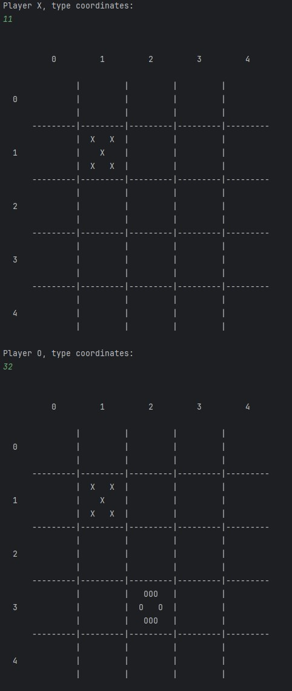

<div align="center">

# Exercise 2 - Tic Tac Toe Tournament

**Tic Tac Toe Tournament** is the second assignment I completed in the *Introduction to Object-Oriented Programming* course at the HUJI.

In this exercise, I developed a modular, extensible Tic Tac Toe Tournament engine in **Java**, with support for dynamic board sizes, win streak customization, human vs. bot matches, and pluggable rendering.  
The project focused on deepening understanding of **Design Patterns**, **Interfaces**, and **OOP Principles**.

[**« Return to Main Repository**](https://github.com/ShayMorad/Intro-to-OOP)

</div>


## Running the Project

To compile and run the tournament locally:

1. Clone the repository:  
   ```bash
   git clone <repo_url>
   ```

2. Navigate to the `src` folder:  
   ```bash
   cd Exercise 2/src
   ```

3. Compile the project using **JDK 11**:  
   ```bash
   javac *.java
   ```

4. Run the tournament:  
   ```bash
   java Tournament <rounds> <board_size> <win_streak> <renderer> <player1> <player2>
   ```

   - **Example:**  
     ```bash
     java Tournament 5 3 3 console human genius
     ```

   - Available options:
     - Renderers: `console`, `none`
     - Players: `human`, `clever`, `genius`, `whatever`


## Media

## Contributions

Contributions are encouraged!  
For any significant changes, it's best to open an issue first and start a discussion.


## License

This project is licensed under the [MIT License](https://choosealicense.com/licenses/mit/).
