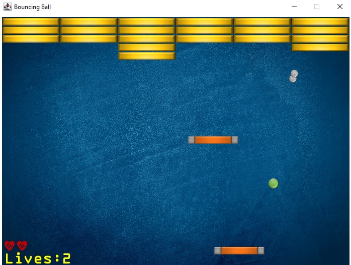

<div align="center">

# Exercise 3 - Bricker


**Bricker** is the third assignment I completed in the *Introduction to Object-Oriented Programming* course at the HUJI.

In this exercise, I built a classic **brick-breaker-style arcade game** using the **DanoGameLab** game framework in **Java**.  
The project emphasized **Inheritance**, **Modular Design**, and applying **OOP Principles** to real-time **Game Development**.


[**« Return to Main Repository**](https://github.com/ShayMorad/Intro-to-OOP)

</div>


## Running the Project

To compile and run the tournament locally:

1. Clone the repository:  
   ```bash
   git clone <repo_url>
   ```

2. Open the project in your preferred IDE (e.g., IntelliJ)

3. Make sure **JDK 11** is configured

4. Run the game from:  
   ```
   src/bricker/main/BrickerGameManager.java
   ```

> The game should launch in a new window using the DanoGameLab engine

> Can also run the game by building the project manually (javac *.java) and running the output file

## Media

## Contributions

Contributions are encouraged!  
For any significant changes, it's best to open an issue first and start a discussion.


## License


This project is licensed under the [MIT License](https://choosealicense.com/licenses/mit/).
