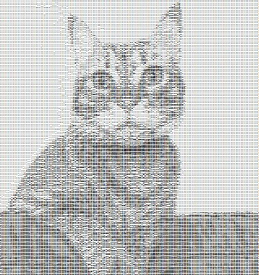

<div align="center">

# Exercise 4 - ASCII Art

**ASCII Art** is the fourth assignment I completed in the *Introduction to Object-Oriented Programming* course at the HUJI.

In this exercise, I developed an interactive **Image-to-ASCII art converter** in **Java**, which runs as a shell-like command interface.  
The project focused on **Image Processing**, **Iterators**, and rendering using both **Console** and **HTML** outputs.


[**« Return to Main Repository**](https://github.com/ShayMorad/Intro-to-OOP)

</div>


## Running the Project

To compile and run the tournament locally:

1. Clone the repository:  
   ```bash
   git clone <repo_url>
   ```

2. Open the project in your preferred IDE (e.g., IntelliJ)

3. Make sure **JDK 11** is configured

4. Run the shell from:  
   ```
   src/ascii_art/Shell.java
   ```

> The shell allows you to load images, modify resolutions, toggle render modes, and convert images into ASCII art in real time.

> Output can be rendered either in the console or as HTML.

> Can also run the game by building the project manually (javac *.java) and running the output file

## Media
### Before:


### After:

## Contributions

Contributions are encouraged!  For any significant changes, it's best to open an issue first and start a discussion.


## License


This project is licensed under the [MIT License](https://choosealicense.com/licenses/mit/).
